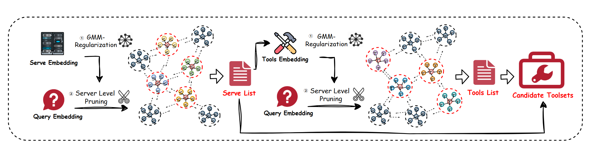

## HGMF: A Hierarchical Gaussian Mixture Framework for Scalable Tool Invocation within the Model Context Protocol

** INTRODUCTION ：A Scalable Probabilistic Pruning Paradigm for Tool Invocation Based on Model Context Protocol.

<div align="center">
  
  <p> HGMF</p>
</div>

```
### Project Structure
HGMF/
├── main.py      #Main Program Experiment Execution
├── matcher.py   #Code for Similarity Matching
├── sampler.py   #Sampler for Selecting Target Tool
├── utils.py     #Utils: Grid Search
├── reformatter.py # json formatter for tool description
├── config.py    #Configuration File for Experiment Parameters
├── data_embeddings.json # Embeddings for Tools and Servers
└── professional_embedding.json # Professional Description embeddings
```