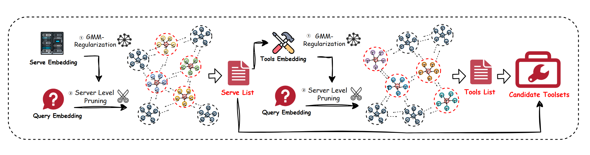

# 🌟 HGMF: Hierarchical Gaussian Mixture Framework

A Scalable Probabilistic Pruning Paradigm for Tool Invocation Based on Model Context Protocol.

<div align="center">
  
  <p><strong>HGMF </strong></p>
  <p>
     <a href="https://arxiv.org/abs/2508.07602" target="_blank" style="text-decoration: none;">
      <span style="background-color: #1e90ff; color: white; padding: 5px 10px; border-radius: 5px; font-weight: bold;">
        🔗 arXiv:2508.07602
      </span
    </a>
  </p>
</div>


---

## 🚀 Overview

HGMF (Hierarchical Gaussian Mixture Framework) is a cutting-edge framework designed to enable scalable and efficient tool invocation within the Model Context Protocol. By leveraging probabilistic pruning and hierarchical modeling, HGMF optimizes tool selection and enhances performance in complex AI-driven workflows. This repository provides all the necessary tools, scripts, and configurations to replicate our experiments and explore the framework's capabilities.

---

## 📂 Project Structure

```plaintext
HGMF/
├── main.py                  # 🚀 Main script for experiment execution
├── matcher.py               # 🔍 Code for similarity matching
├── sampler.py               # 🎯 Sampler for selecting target tools
├── utils.py                 # 🛠️ Utility functions, including grid search
├── reformatter.py           # 📝 JSON formatter for tool descriptions
├── config.py                # ⚙️ Configuration file for experiment parameters
├── data_embeddings.json     # 📊 Embeddings for tools and servers
└── professional_embedding.json # 💼 Professional description embeddings
```

---

## 🛠️ Getting Started

### Prerequisites

- **Python**: Version 3.10.x
- **Conda**: For virtual environment management
- **Hardware**: Compatible with standard GPU setups

### Environment Setup

1. **Create and Activate a Virtual Environment**:
   ```bash
   conda create -n hgmf_env python=3.10 -y
   conda activate hgmf_env
   ```

2. **Install Dependencies**:
   ```bash
   pip install -r requirements.txt
   ```

### Model Download

1. Download the required Large Language Model (LLM) via **Ollama**:
   ```bash
   ollama pull <llm-name>
   ```

2. Launch the model server:
   ```bash
   ollama serve
   ```

### Dataset
Dataset Resource ：This dataset is derived from the official MCP repository, containing all filtered tools from the repo: it includes 308 servers and a total of 2,797 tools. For subsequent task adaptation , I have converted the tool data in this dataset into  embeddings .
The following datasets are included in the repository:
- `data_embeddings.json`: 🗄️ Origin Embeddings for tools and servers.
- `professional_embedding.json`: 📋 Professional description embeddings.
---

## 🧪 Running Experiments

1. **Execute the Main Program**:
   ```bash
   python main.py
   ```

2. **Results**:
   Experiment outputs will be saved in the `grid_search_results/` directory for easy access and analysis.

---

## ⚙️ Configuration

- Modify experiment parameters in `config.py` to customize your setup.
- Adjust the sample size for experiments in `utils.py` to fine-tune performance.
- sampler.py ：Tweak parameters for hierarchical Gaussian mixture sampling and clustering logic:
<sample_threshold> ：Threshold for triggering clustering during sampling .
<n_clusters>  ：Number of clusters for sampling. If set to None, the value is automatically calculated as the square root of the total sample count (sqrt(N)).
<sample_num> ：Maximum number of samples selected per cluster .
<topk_cluster> ：Top-k high-priority clusters selected for sampling .
<lambda_inter> ：Mean regularization weight for inter-cluster constraints .
<beta_intra> ：Penalty weight for the trace of intra-cluster covariance .
<w_balance> ：Directional penalty weight for intra-cluster covariance .
<max_iter> ：Maximum number of iterations for the Expectation-Maximization (EM) algorithm .
<tol> ：Convergence tolerance based on log-likelihood .
<reg_covar> ：Base regularization term for covariance matrices .
---
## 📝 Citation

If you find HGMF useful for your research, please cite our work:

```bibtex
@misc{xing2025hgmfhierarchicalgaussianmixture,
      title={HGMF: A Hierarchical Gaussian Mixture Framework for Scalable Tool Invocation within the Model Context Protocol}, 
      author={Wenpeng Xing and Zhipeng Chen and Changting Lin and Meng Han},
      year={2025},
      eprint={2508.07602},
      archivePrefix={arXiv},
      primaryClass={cs.AI},
      url={https://arxiv.org/abs/2508.07602}, 
}
```

---

## 📜 License

HGMF is licensed under the [MIT License](LICENSE). Please review the license file for details.

---

## 👏 Acknowledgements

We thank the following projects and communities for their contributions and inspiration:
- [Ollama](https://ollama.ai): For providing an efficient LLM serving platform.
- [MCP-zero]: (https://github.com/xfey/MCP-Zero)For its open-source implementation of the Model Context Protocol (MCP) — which served as a key reference for designing our hierarchical tool invocation context framework.
---

## 🌟 About

HGMF is a pioneering framework for scalable tool invocation, designed to empower researchers and developers in building efficient AI-driven systems. We welcome contributions, feedback, and collaboration to advance this exciting field!

---

## 📬 Contact

For questions, suggestions, or collaboration opportunities, please reach out to us:
- 📧 Email: [wpxing@zju.edu.cn, zhipengchen@jmu.edu.cn]
---

© 2025 GenTel Lab Team
